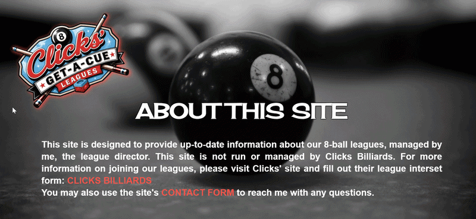

# Get-A-Cue Leagues

Please visit the deployed version of this site: [**GET-A-CUE LEAGUES**](https://poolstuff.github.io/league/)

---

---

### TABLE OF CONTENTS

-   [Description](#description)
-   [Usage](#usage)
-   [Future Development](#future-development)
-   [Change Log](#change-log)
-   [Questions and Contact](#questions-and-contact)

---

---

## DESCRIPTION

This is an informative site for an in-house, Get-A-Cue leagues at Click's Billiards in Tucson, Arizona. There are two ****GAC**** leagues: one on Wednesday nights and the other on Thursday nights. For both nights, this site contains a _Schedule_ page, a _Team_ page, and a _Singles_ page. See the <ins>PAGES</ins> subsection that follows.

### PAGES

**_INDEX_**  
  
This is the landing page for the site. The site is navigable from here by utilizing the **WEDNESDAY**, **THURSDAY**, or **MORE** text. On desktop view ports, a hover effect causes link options to appear. On mobile view ports, clicking/tapping on the text causes the link options to appear. For **WEDNESDAY** and **THURSDAY**, the links take the user to the **SCHEDULE**, **TEAM**, or **SINGLES** pages. Currently, the **MORE** text only links to the **ABOUT** page.

**_ABOUT_**  
  
At the top of the page is the **GAC** league logo, which is acts as a link to the home page. Currently, the **ABOUT** page only has a brief about description and some updates I hope to include.

****CONTACT****  
  
This page continues the trend having a league logo that also acts as a link home at the top-let of the page. It has brief text explaining why a user might message me, then a functioning contact form to the right.

**_SCHEDULE_**  
  
The **SCHEDULE** pages for Wednesday and Thursday are functionally the same. At the top of the pages are logos for the **GAC** league. To make it clearer which night's schedule the page is displaying, the logos have an appropriate _Wednesday_ or _Thursday_ banner. They are also a link back to the home page.  
The majority of the pages are tables which are the schedules for the seasons by night. They display the date, week number, and a series of _Home_ and _Away_ columns containing the teams' names in the rows below. For Wednesday, there is an additional _BYE_ column indicating which team has the bye by week. Because of the bye, the table assignments aren't static like Thursday, so the team names all have an effect where, when clicked or hovered over, a table assignment is displayed. For Thursday, the table has an additional header that shows the table assignments.

**_TEAMS_**  
  
Again, the _TEAM_ pages for Wednesday and Thursday are functionally the same. As on all the other pages, there is a logo that is a link to the home page that also informs the user for what night the information they're seeing is.  
The next element on the page is a table containing team data. The order of the teams is determined by their standings in league. It displays the team names, the teams' total points, their weekly average, then their scores by week.  
The final element is a series of team cards. The cards have the teams' assigned team numbers on the side of the card, a logo that has the team names, and the roster listed in the order in which the players appear on the score sheets.

**_SINGLES_**  
  
The SINGLES pages follow the same practice of have a logo that is a link home and shows which team night is being displayed. There are two tables in these pages. The first table is the league standings by player. These tables will display the player names, their corresponding teams, and their points. The second table contains all players' statistical data: current total, weekly average, followed by their scores by week.

### STYLE

## USAGE

This is an informative site meant to be used referentially. Interaction with the **GAC** site is minimal, only having a handful of links throughout. In the future, I will add a standard contact form so users can contact me for bug reporting, feature requests, and league information. If interest is there, I may also add a message board for league discussions.

On the site maintenance side, paste the most recent league spreadsheets into the project's data folder in the root of the directory, located at <ins>./data</ins>, next send the bash command `node parsedata.js`, then redeploy the updated site.

## FUTURE DEVELOPMENT

Planned updates:

-   Add a message board for league discussions.
-   Ongoing stylistic updates.

Feature requests from users will be prioritized when it makes sense and I'm able.

## CHANGE LOG

2026.05.31 **V2.0** This was a large update and is also the first site update to include a README file. Updated site stylistically and the programmatic features are working as desired. 

## QUESTIONS and CONTACT

Should anyone ever actually read this and feel so inclined, feel free to contact me:  
pablodlc@gmail.com  
❤️
