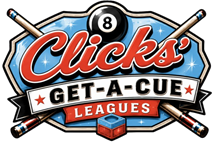
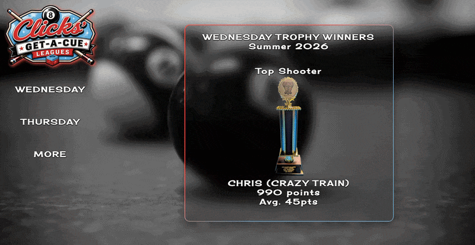
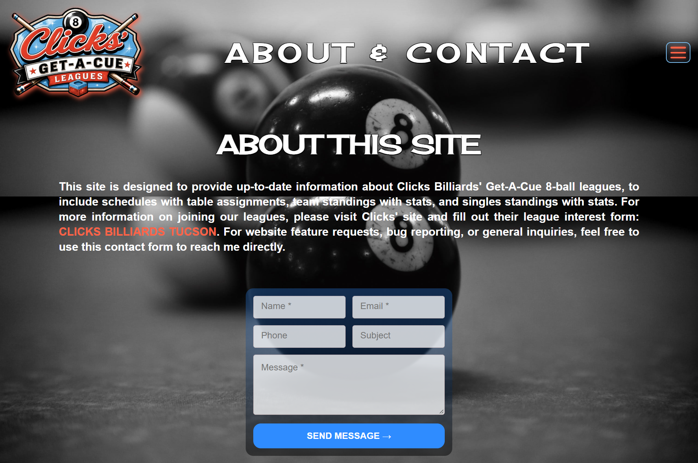
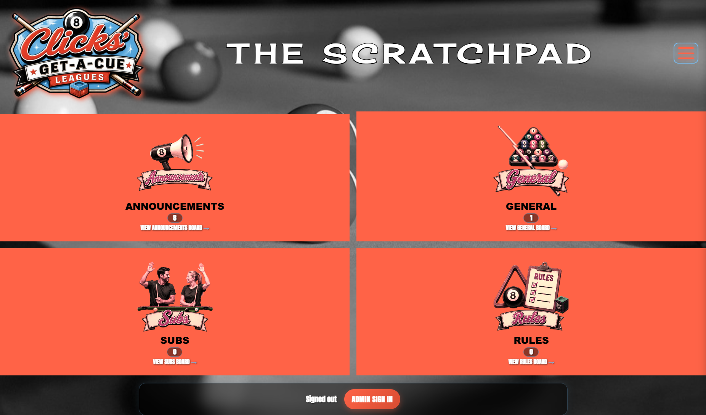
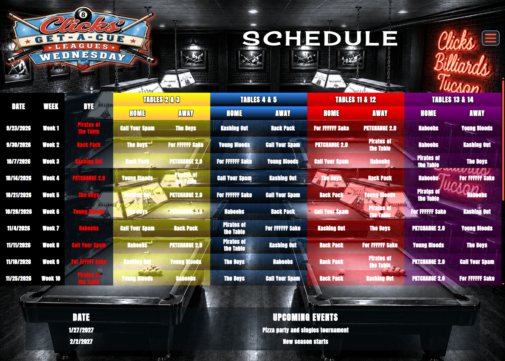
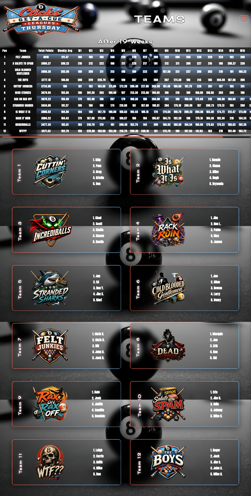
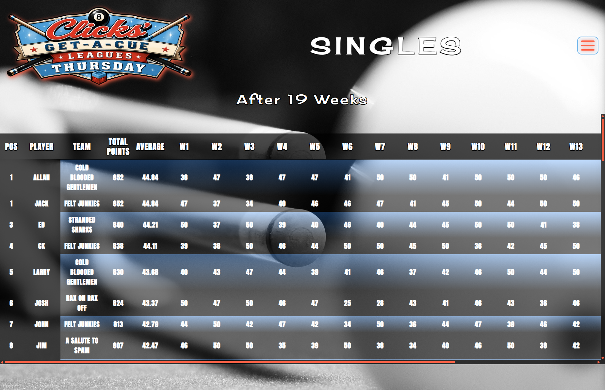

# Get-A-Cue Leagues

Please visit the deployed version of this site: [**GET-A-CUE LEAGUES**](https://getacueleagues.com)

---

---

### TABLE OF CONTENTS

-   [Description](#description)
-   [Pages](#pages)
-   [Usage](#usage)
-   [Technologies](#technologies)
-   [Questions and Contact](#questions-and-contact)

---

---

## DESCRIPTION

This is an informative site for an in-house, Get-A-Cue leagues at Click's Billiards in Tucson, Arizona. There are two ****GAC**** leagues: one on Wednesday nights and the other on Thursday nights. For both nights, this site contains a _Schedule_ page, a _Team_ page, and a _Singles_ page. There is also a message board page called _The Scratchpad_. See the <ins>PAGES</ins> subsection that follows. 

## PAGES

**_INDEX_**  
  
This is the landing page for the site. The site is navigable from here by utilizing the **WEDNESDAY**, **THURSDAY**, or **MORE** text. On desktop view ports, a hover effect causes link options to appear. On mobile view ports, clicking/tapping on the text causes the link options to appear. For **WEDNESDAY** and **THURSDAY**, the links take the user to the **SCHEDULE**, **TEAM**, or **SINGLES** pages. The **MORE** options direct the user to either the **ABOUT & CONTACT** or **THE SCRATCHPAD** pages. As demonstrated in the gif above, there is a card displaying the Wednesday night trophy winners. Since this is the first season with the site, there isn't a Thursday card for the trophy winners yet, but it will be added at the ended of the Thursday season.  

**_ABOUT & CONTACT_**  
  
At the top-left of the page is the **GAC** league logo, which is acts as a link to the home page. At the top-right is a navigation burger to navigate to any other page on the site. The text is a brief description of the page. At the bottom of the page is a contact form that can be used to contact me directly with any questions, requests, or for bug reporting.

**_THE SCRATCHPAD_**
 
This is the message board page, called **The Scratchpad**. The Scratchpad has four forums. Clicking on any of the forums opens a corresponding modal that displays posts and has a form where users can enter posts. **Announcements** is the only forum where only admins can post, but anyone can comment on the posts. I use **Announcements** to let players know when scores are updated on the page, for site updates when I make significant updates to the site, when I incorporate feature requests into the site, or when I complete a bug fix. The **General** forum is for any topic any user would like to discuss. **Subs** is intended for subs to let teams know they are available to sub or for teams to request subs. The last forum is **Rules**, intended for rules discussion within our league. At the bottom of this page is the admin sign in section.

**_SCHEDULE_**  
  
The **SCHEDULE** pages for Wednesday and Thursday are functionally the same. At the top of the pages are logos for the **GAC** league. To make it clearer which night's schedule the page is displaying, the logos have an appropriate _Wednesday_ or _Thursday_ banner. They are also a link back to the home page.  
The majority of the pages are tables which are the schedules for the seasons by night. They display the date, week number, and a series of _Home_ and _Away_ columns containing the teams' names in the rows below. For Wednesday, there is an additional _BYE_ column indicating which team has the bye by week. Because of the bye, the table assignments aren't static like Thursday, so the team names all have an effect where, when clicked or hovered over, a table assignment is displayed. For Thursday, the table has an additional header that shows the table assignments.

**_TEAMS_**  
  
Again, the _TEAM_ pages for Wednesday and Thursday are functionally the same. As on all the other pages, there is a logo that is a link to the home page that also informs the user for what night the information they're seeing is.  
The next element on the page is a table containing team data. The order of the teams is determined by their standings in league, as demonstrated in the *POS* column. It displays the team names, the teams' total points, their weekly average, then their scores by week.  
The final element is a series of team cards. The cards have the teams' assigned team numbers on the side of the card, a logo that has the team names, and the roster listed in the order in which the players appear on the score sheets.

**_SINGLES_**  
  
The SINGLES pages follow the same practice of have a logo that is a link home and shows which team night is being displayed. The table on the page displays the singles' standings. It also shows each players' team name, their nightly average, and their scores by week.
  
## USAGE

This is an informative site meant to be used referentially. Most interaction with the **GAC** site is minimal, only having a handful of links throughout. **The Scratchpad** is the most interactive part of the page, intended to be a message board.

On the site maintenance side, paste the most recent league spreadsheets into the project's data folder in the root of the directory, located at <ins>./data</ins>, next send the bash command `node parsedata.js`, then redeploy the updated site.

## TECHNOLOGIES
The **GAC** page was created with HTML, CSS, and JavaScript. The contact form is handled by Web3Forms and I used Firebase to handle **The Scratchpad** boards.

## QUESTIONS and CONTACT

Should anyone ever actually read this and feel so inclined, feel free to contact me:  
pablodlc@gmail.com  
❤️
